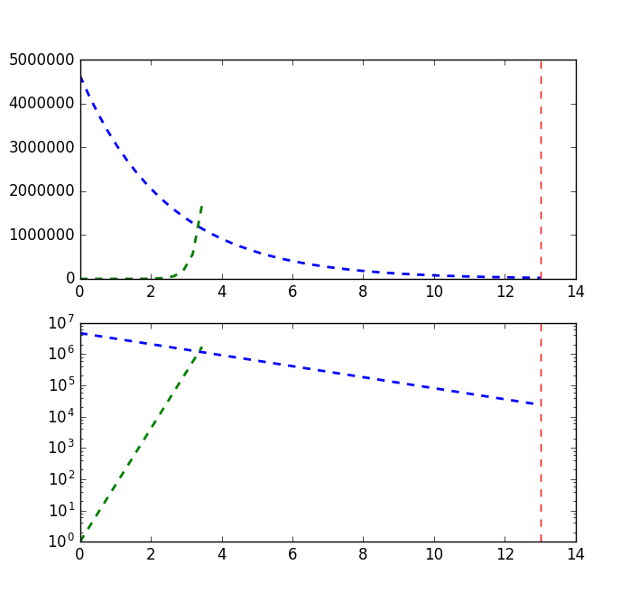
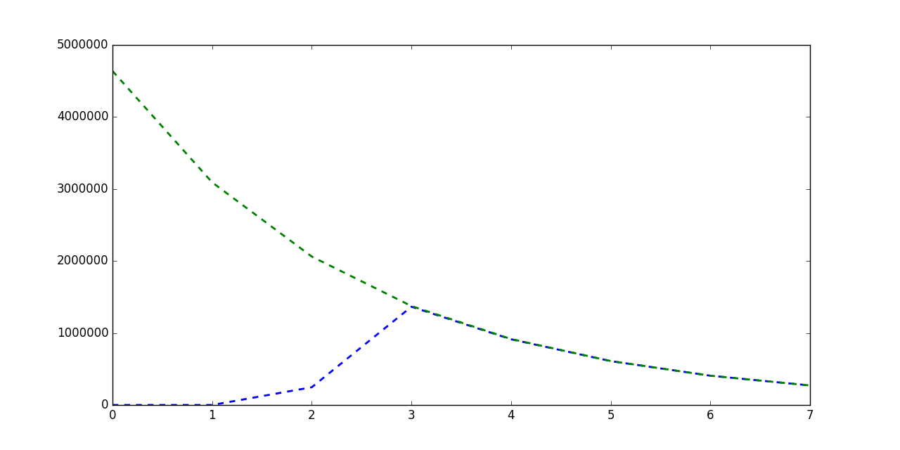

# Análisis del algoritmo DC3

## Resumen del algoritmo

El algoritmo para construir arrays de sufijos **DC3** funciona, de forma muy resumida, de la siguiente manera:

    DC3(text):
    B12 -> Array con índices 3n+1 + Array con índices 3n+2 del texto
    Ordenar B12 segun las triplas a las que apuntan B12[i]
    Si existe *(B12[i]) y *(B12[j]) iguales con i != j, aplico recursivamente.
    B12 -> Array con índices 3n
    Merge B0 y B12, utilizando B12 para desempatar colisiones en B0
    Devuelvo los índices ordenados

Si asumimos que B12 se ordena en O(N) (por ejemplo, usando *RadixSort*, por teorema del maestro se comprueba que el órden del algoritmo es O(N)

## Implementación del algoritmo

### Estructuras utilizadas

Se utilizó un array en memoria para almacenar el texto, cada caracter fue representado como un entero. Se utilizó otro array de enteros para almacenar índices.
Los buckets para el radix-sort se organizaron en **vectores de vectores**.

### Problemas acarreados por la implementación elegida

Los problemas más fuertes que trajo *DC3* fue el **uso excesivo de memoria** y **lentitud en el ordenamiento**.
Debido a que se utilizaba **una lista para cada caracter** al momento de hacer radix-sort, las últimas iteraciones tendían a tener un "alfabeto" muy extenso, por lo que el radix ocupaba mucho en memoria (aprox 100 el tamaño del texto original).

## Análisis del algoritmo

### Análisis de las cotas

#### Máximo iteraciones según el texto

La cantidad de iteraciones está **acotada por la longitud del substring repetido más largo**. Esto se debe a que dos substrings repetidos son dos sufijos que deben ser desempatados al momento de aplicar el ordenamiento.
Supongamos el peor caso, un string con N elementos iguales. El substring repetido más largo es de longitud N-1 (el string completo y el substring resultado de quitarle la primer letra). Al aplicar DC3, obtengo ${2 \over 3} N$ triplas repetida, más una o dos triplas distintas debido al padding al final del string. 
A medida que se va aplicando recursivamente, el texto reduce su tamaño a 2/3 del original, mientras que el alfabeto duplica su tamaño (debido a que el padding va generando nuevos "caracteres".
Notar que este piso de $2^t$ también indica el tamaño mínimo del alfabeto a traves del tiempo. 

Para aproximar el número de iteraciones máximo, busco t:

$N {({2 \over 3})}^{t} > 2^t$

$N {2^t \over 3^t} > 2^t$

$N > 3^t$

$t < log_{3}(N)$

El máximo de iteraciones está dado por $log_{3}(N)$

#### Mínimo de iteraciones según abecedario

Cada tripla puede tener cualquiera de las letras del abecedario (ignoramos el caracter de padding al final del string), por lo tanto, existen $\sigma^3$ triplas posibles. El texto, a su vez, forma ${2 \over 3} N$ triplas, por lo que si ${2 \over 3} \sigma^3 < N$, entonces hay triplas si o si repetidas. 

### Gráfico teórico de las iteraciones sobre ecoli.dat

A continuación un gráfico teórico del máximo y mínimo de iteraciones sobre el caso de prueba *ecoli.dat*

$N = 4638690$

$\sigma = 4$

## Deducciones empíricas

### Comportamientos de la memoria según el texto analizado

Además de set de pruebas provisto por el docente, se utilizó texto formado por números aleatorios para probar la eficiencia del algoritmo.

Se pudo deducir que, si el texto presentaba mucha entropía, las iteraciones del algoritmo tendían a incrementar el tamaño del radix casi de forma cúbica.
La cantidad de iteraciones, por otra parte, solían ser menores, ya que la longitud de los substrings repetidos dentro del texto a buscar suele ser corta.
Cabe recordar que la cantidad de iteraciones tiene como cota log3 del substring repetido más largo.

Debido al crecimiento cúbico del alfabeto, el tamaño del mismo casi no tuvo impacto en la performance del algoritmo, como si lo tuvo las largas repeticiones, que implicaban mayor cantidad de iteraciones.

## Optimizaciones posibles

Hay varios trabajos de optimización realizados sobre este algoritmo, principalmente aplicados al método de ordenamiento. Muchos de estos trabajos constan en paralelizar y distribuir radix sort, por ejemplo, con ayuda de OpenCV.

Como apreciación personal, las optimizaciones deberían estar orientadas a llevar este algoritmo a una versión semi-online, de forma tal de reducir N (bajar el techo del gráfico) y que la curva de sigma intersecte antes que sea muy grande la memoria utilizada.

