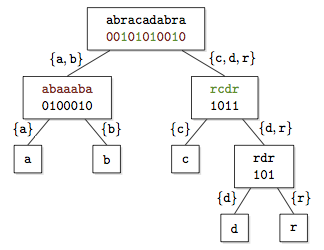
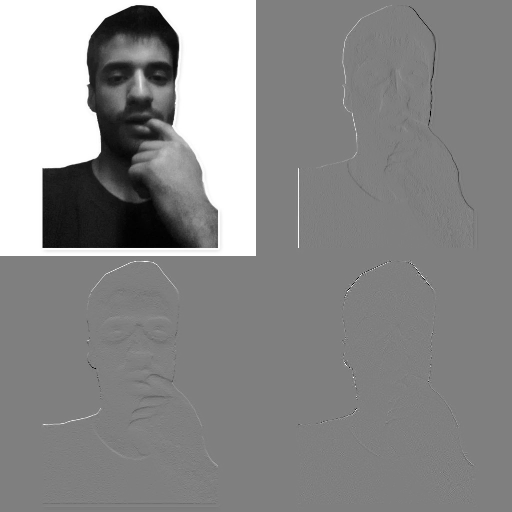
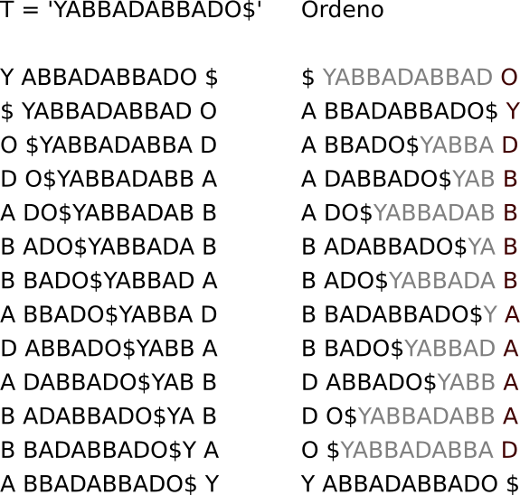
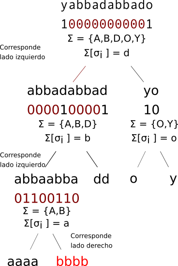
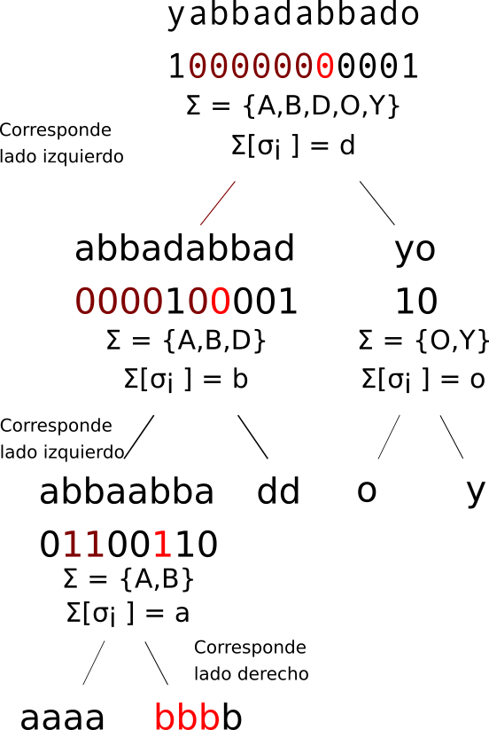
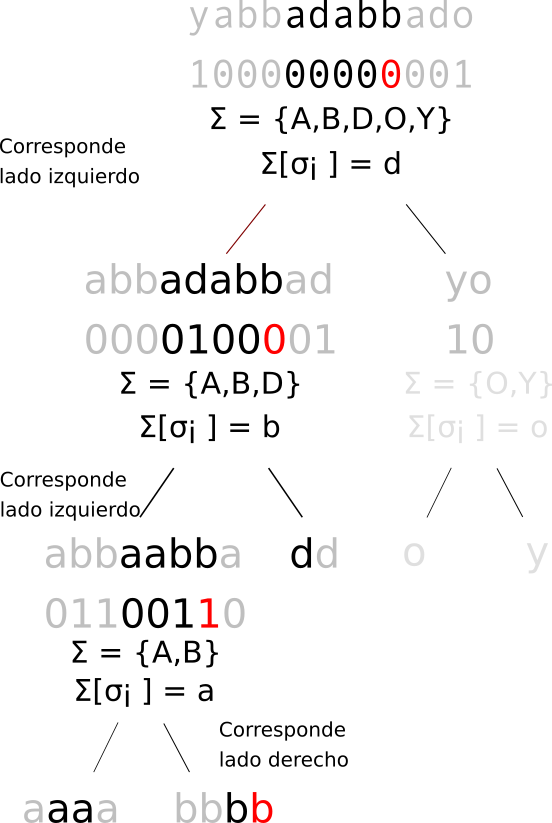

# Wavelet suffix tree

Estructura sucinta inspirada en la transformación wavelet de señales

---

## Repaso

### Rank y Select

Repasamos 2 operaciones básicas:

$rank_{A}(u)$: Cantidad de elementos en A *menores o iguales* a U

$select_{A}(k)$: El *k-ésimo menor* elemento en A 

Ejemplos:

$A = [2, 5, 3, 2, 1, 4, 3]$

--

$rank_{A}(3) = 5$

$select_{A}(3) = 2$ 

---

### Range rank y select

Rank y select pueden aplicarse *sobre rangos*:

Ejemplos:

$A = [2, 5, 3, 2, 1, 4, 3]$

$rank_{[2..5]}(3) = 3$

$select_{[3..6]}(3) = 6$ 

--

El caso especial $select_{R}(1)$ es conocido como *range minimum query*.

---

## Rank y Select de sufijos

Dado un texto T, puedo armar un array de sufijos *SA*, y un array inverso de sufijos, *ISA* tal que

$SA[k] < SA[k+1]$ (lexicograficamente)

$SA[i] = j \Leftrightarrow ISA[j] = i$

--

T = "YABBADABBADO"

SA = [1, 6, 4, 9, 3, 8, 2, 7, 5, 10, 11, 0]

ISA = [11, 0, 6, 4, 2, 8, 1, 7, 5, 3, 9, 10]

---

T = "YABBADABBADO"

| i | SA | Sufijo |
|---|---|--------------|
| 0 | 1 | abbadabbado |
| 1 | 6 | abbado |
| 2 | 4 | adabbado |
| 3 | 9 | ado |
| 4 | 3 | badabbado |
| 5 | 8 | bado |
| 6 | 2 | bbadabbado |
| 7 | 7 | bbado |
| 8 | 5 | dabbado |
| 9 | 10 | do |
| 10 | 11 | o |
| 11 | 0 | yabbadabbado |

--

$select_{T}(5) = T[SA[5-1]..] = T[3..] = badabbado$

$T[4..] = adabbado$

$rank_{T}(T[4..]) = ISA[4] = 2$

---

# Wavelet trees

Estructuras **sucintas** que permiten hacer un *select* con las siguientes características:

| Espacio | Consulta | Construccion |
|---------|----------|--------------|
| $\mathcal{O}(n)$ | $\mathcal{O}(P.\log{}_{2}n)$ | $\mathcal{O}(n \sqrt{\log{}n})$ |

-- 

---

## Posible inspiración

Posiblemente la transformada [D]WT, en la que, se conservan tanto información sobre la frecuencia como información sobre el tiempo.

--

Demo [acá](http://bigwww.epfl.ch/demo/ip/demos/08-wavelets/)

	
	

---

## ¿Cómo funciona la DWT?

Convoluciono una matriz de tamaño $2x2k$ sobre una señal unidimensional.

Ej: matriz de 2x2 (Haar)

$X \ast {1 \over 2} \begin{bmatrix}
1 & 1 \\\\ 1 & -1
\end{bmatrix}$

Existen coeficientes para matrices más grandes.

Es una transformada inversible, convolucionando la matriz inversa.

---

## ¿Cómo se aplica esto a texto?

Escaneo el texto marco las letras de "alta" y "baja" frecuencia con un 1 y un 0 respectivamente.

Aplico recursivamente hasta tener hojas de un solo tipo de caracter.

---

# Construcción

Calculamos $\sigma_i = \lfloor {\sigma \over 2} \rfloor$

--

Recorremos T, si el caracter sobre el que estamos es menor o igual a $\sigma_i$, escribimos 0, sino, escribimos 1

--

Dividimos $\Sigma$ en $\Sigma\_{izquierda}$ y $\Sigma\_{derecha}$ donde $\Sigma\_{izquierda}$ son los caracteres $\Sigma\_{[0..\sigma\_i]}$ y $\Sigma\_{derecha} = \Sigma\_{[\sigma_{i}+1 .. |\Sigma|]}$

--

Calculamos $\sigma\_{j} = \lfloor {|\Sigma\_{izquierda}| \over 2} \rfloor$

--

Para cada caracter $c$ marcado con 0, escribo 0 si $c <= \sigma_{j}$ o 1 en caso contrario.

--

Repito para cada caracter marcado con 1, utilizando $\Sigma\_{derecha}$

---

# Construcción

	

---

## Almacenamiento

Se suele utilizar Run-Length encoding para almacenar los bits.

Se pueden almacenar números de longitud fija o variable.

Se utiliza RRR para facilitar el select y rank de bits

---

### Optimización (y algo más): BWT

Agrupa caracteres similares en un texto, haciendo más fácil la compresión de los mismos.

El uso de la BWT permite realizar búsquedas mediante el *FM-Index*.

Es posible obtener la BWT a partir del suffix array

F es el vector tal que sus corresponden a la primer columna de la matriz de transformación BWT

$SA = [12, 1, 6, 4, 9, 3, 8, 2, 7, 5, 10, 11, 0]$

$F[i] = T[SA[i]]$

Podemos obtener L el vector correspondiente a BWT(T) como

$L[i] = T[SA[i] - 1]$

---

SA=[12,1,6,4,9,3,8,2,7,5,10,11,0]

---

### Búsqueda de patrones sobre un FM-Index

Primero debemos armar una tabla de ocurrencias:

L = 'OYDBBBBAAAAD$'

| c | O | Y | D | B | B | B | B | A | A | A | A | D | $ |
|---|---|---|---|---|---|---|---|---|---|---|---|---|---|
| $ | 0 | 0 | 0 | 0 | 0 | 0 | 0 | 0 | 0 | 0 | 0 | 0 | 1 |
| A | 0 | 0 | 0 | 0 | 0 | 0 | 0 | 1 | 2 | 3 | 4 | 4 | 4 |
| B | 0 | 0 | 0 | 1 | 2 | 3 | 4 | 4 | 4 | 4 | 4 | 4 | 4 |
| D | 0 | 0 | 1 | 1 | 1 | 1 | 1 | 1 | 1 | 1 | 1 | 2 | 2 |
| O | 1 | 1 | 1 | 1 | 1 | 1 | 1 | 1 | 1 | 1 | 1 | 1 | 1 |
| Y | 0 | 1 | 1 | 1 | 1 | 1 | 1 | 1 | 1 | 1 | 1 | 1 | 1 |

--

Y luego una tabla de ranks

| c | $ | A | B | D | O | Y |
|---|---|---|---|---|---|---|
| C | 0 | 1 | 5 | 9 | 11 | 12 |

???

Los patrones se buscan del final al principio

Por ejemplo, si quiero buscar el patrón "DAB", debo buscar primero los prefijos que empiezan con B

Para esto, utilizamos la formula [C[a]..C[a+1]]

$[C[B] .. C[B+1]] = [5..8] 

Ahora buscamos el rango de los prefijos que empiezan con AB.
Para esto tengo que buscar la primer y última A en la columna L, pero limitándome al rango calculado para los prefijos que empiezan con B (es decir [6..9])
Tanto a la primer como última A las mapeo de la columna L a la columna F utilizando la siguiente fórmula:

F(A) = [C[A] + Rank(A, inicio).. C[A] + Rank(A, fin)

Inicio y fin son los límites obtenidos en el paso anterior (es decir, 5 y 8 para B)

F(A) = [1 + Rank(A, 5).. 1 + Rank(A, 8)] = [1+0..1+2] = [1..3]

Repito para D

F(D) = [9 + Rank(D, 1).. 9 + Rank(D, 3)] = [9+0..9+1] = [9..10]

Se obtiene entonces que los índices indican la cantidad de apariciones de DAB

---

## Rank y select sobre wavelet trees

### Rank sobre la BWT

Quiero contar las letras menores o iguales a "B" en el texto "YABBADABBADO"

	

???

Al igual que como hicimos en la construcción, calculamos $\sigma_i = \lfloor {\sigma \over 2} \rfloor$

$\Sigma\_{izquierda} = \{A, B, D\}$ y $\Sigma\_{derecha} = \{O, Y\}$

Bajamos al bitmap de $\Sigma\_{izquierda}$, y volvemos a dividir.

Aplicamos recursivamente hasta llegar a $|\Sigma| = 1$, sumo hojas que recorrí y las de la izquierda

$\Sigma\_{izquierda 2} = \{A, B\}$

$\Sigma\_{derecha 2} = \{D\}$

Dividimos una vez más, y nos queda

$\Sigma\_{izquierda 3} = \{A\}$

$\Sigma\_{derecha 3} = \{B\}$

Como $|\Sigma\_{derecha 3}| = 1$, significa que llegué a la hoja de B. La cantidad de caracteres B es la cantidad de 1 el en $\Sigma\_{padre} = \Sigma\_{izquierda 2}$. La cantidad de caracteres menores es la cantidad de bits $\Sigma\_{izquierda 3}$

Notar que si se hubiera hecho el rank de O, necesitamos el tamaño del bitmap de $\{A,B,D\} + \{O\}$ 

---

## Rank y select sobre wavelet trees

### Select sobre el texto completo

Busco el índice de la tercer ocurrencia de B

	

???

Arranco por la hoja de B

Como es hoja derecha, le corresponde el bit 1

Subo al padre y busco la posición del tercer 1, que es 5.

El padre es a su vez hijo izquierdo de su padre, por lo que le corresponde el bit 0.

Subo a este padre y busco el sexto 0 (porque p = 5). Este 0 está en la posición 6.

Aplico recursivamente, buscando el séptimo 0 (ya que p = 6). Finalmente, el tercer B se encuentra en la posición

---

## Rank y select sobre un sub rango

$T[l..N-r]$ el substring sobre el que se quiere hacer la búsqueda

Contamos los ceros y unos entre 0 y $l$.

Por cada 0 que contamos, ignoramos un valor, de izquierda a derecha, en el hijo izquierdo, y por cada 1, ignoramos en el hijo derecho.

	

???

**Nota**: Para optimizar la cuenta de 1s, se utiliza la instrucción Popcount del procesador.

**Nota2**: El paper analiza el uso de *sumas acumulativas*, mejorando ampliamente el performance del rank, pero agrandando considerablemente el tamaño del árbol.

---

# Wavelet Suffix trees

** Ver diapositiva externa **

---

.center[#¿Consultas?]

